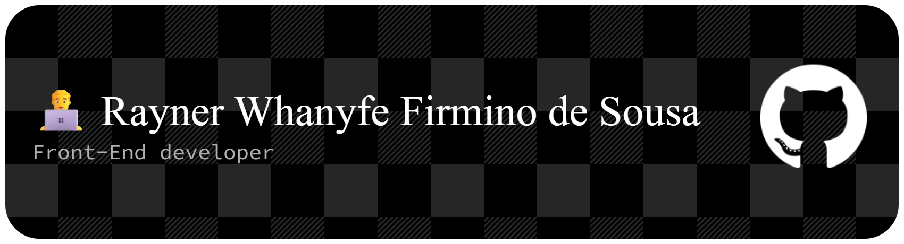

  

## 🚀 Sobre mim

💻 Desenvolvedor Front-End com experiência em React.js, Next.js, JavaScript e TypeScript  

🚀 Focado na criação de interfaces modernas, responsivas e organizadas, buscando sempre melhorar performance e experiência do usuário  

⚙️ Atualmente migrando gradualmente para o desenvolvimento Full Stack, aprofundando conhecimentos em front-end e back-end  

🤝 Facilidade para trabalho em equipe, adaptação a novos desafios e aprendizado contínuo  

🌍 Sempre explorando novas tecnologias e buscando evolução técnica constante

---

# 🛠️ Tecnologias e Ferramentas

### Frontend  

  
  
  
  
  
  
  
  
  
  
  

# 📌 Experiência Profissional

## 💼 Estagiário de TI

**Genius Itapipoca** | Ago 2025 – Dez 2025

* Organização e atualização de dados e valores em planilhas.
* Apoio na automatização de processos internos.
* Trabalho em conjunto com supervisor para melhoria operacional.
* Suporte técnico e administrativo.

---

# 🌐 Contato

📧 [raynerwhanyfek@gmail.com](mailto:raynerwhanyfek@gmail.com)
📍 Amontada - CE
📱 (88) 8219-0047

---

# ⚡ Frase que define minha jornada

> “Evoluir todos os dias vale mais do que tentar parecer pronto.”
